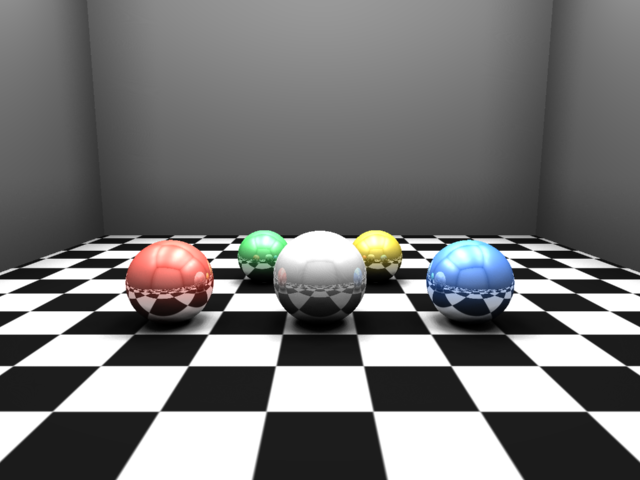
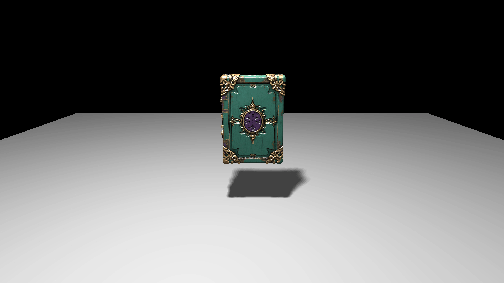
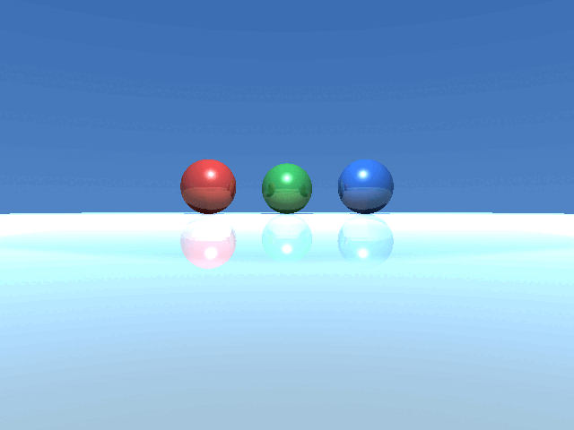
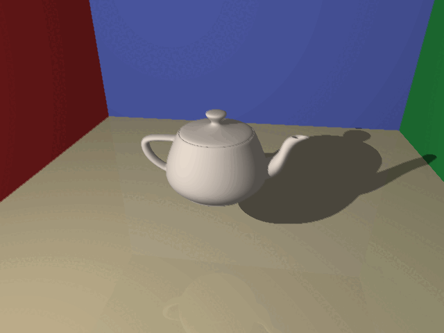

# CPU Raytracer

A multithreaded CPU raytracer written in C++ that renders photorealistic scenes and exports frame sequences as PNG images or animated GIFs.



## Gallery

| Book | Fresnel | Mesh |
|---|---|---|
|  |  |  |


## Features

- **Geometric primitives** — sphere, plane, cylinder, cone, pyramid, rectangle, quad, triangle
- **Triangle mesh import** — OBJ files with vertex normals and texture coordinates; smooth shading via barycentric interpolation
- **BVH acceleration** — bounding volume hierarchy with AABB slab intersection, reducing triangle tests from O(n) to O(log n)
- **Lighting model** — point lights, ambient, diffuse, specular/glossy reflections, shadows
- **Reflections** — recursive mirror reflections with configurable specularity per material
- **Textures** — image textures and procedural textures (Perlin/simplex noise, Worley/cellular noise) via FastNoise
- **Transforms** — full 4×4 matrix pipeline (rotation, translation, scale) with automatic inverse computation
- **Tonemapping & gamma correction** — configurable per scene
- **Animation** — per-frame rotation interpolation exported as PNG sequences; GIF assembly via ImageMagick
- **Multithreaded rendering** — column-parallel rendering across all available hardware threads
- **JSON scene format** — scenes defined in JSON; no recompile needed to change a scene
- **Regression tests** — CTest suite with pixel-exact image comparison against reference renders

## Build & Run

Requires CMake ≥ 3.5 and ImageMagick with Magick++ headers.

```bash
bash run.sh
```

This builds the project, runs the test suite, renders all frames, and assembles `output.gif`.

Or step by step:

```bash
cmake -B build .
cmake --build build
ctest --test-dir build
./build/Animation
convert -delay 3 -loop 0 output/book_spin/frame*.png output.gif
```

### Render a single scene

```bash
./build/Render scenes/spheres.json output.png
```

## Testing

```bash
ctest --test-dir build
```

Tests render known scenes and compare pixel-for-pixel against reference images in `tests/references/`. To regenerate a reference after an intentional change, delete the relevant file from `tests/references/` and rerun.

## Project Structure

```
raytracer/
  include/   — headers: shapes, lights, camera, materials, BVH, transforms
  src/       — implementations
scenes/      — JSON scene definitions
obj/         — OBJ mesh files
textures/    — image textures
tests/
  render_test.cpp   — test renderer binary
  compare.sh        — renders and compares against reference
  references/       — reference PNG images for regression testing
output/      — rendered frames (generated at runtime)
examples/    — sample renders and animations
```
